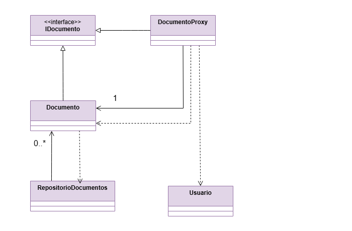

# Implementação do Padrão de Projeto:  Proxy

O Padrão Proxy é um padrão de projeto estrutural que tem como objetivo fornecer um substituto ou intermediário para outro objeto. O Proxy controla o acesso ao objeto real, permitindo que se execute algo antes ou depois que a requisição chegue ao objeto principal.

Este padrão é ideal para cenários onde se deseja adicionar uma camada de controle, como:

- Controle de Acesso (Protection Proxy): Verificar permissões antes de executar uma operação sensível.
- Carregamento Sob Demanda (Virtual Proxy): Adiar a criação e carregamento de um objeto custoso até o momento em que ele é realmente necessário (Lazy Loading).
- Registro de Log (Logging Proxy): Registrar todas as chamadas ao objeto real.


## Cenário Aplicado: Controle de Acesso a Documentos Confidenciais
Para esta implementação, foi escolhido o cenário de Gestão de Documentos em um sistema. O objetivo é proteger o acesso ao conteúdo completo de um documento e garantir que o documento real (que pode ser custoso para carregar de um repositório) só seja instanciado quando estritamente necessário.

Este cenário é um exemplo clássico do Padrão Proxy, onde:
- Um Documento é o objeto real (Real Subject) que contém dados sensíveis.
- Um DocumentoProxy é o substituto (Proxy) que controla o acesso e gerencia o carregamento.
- A interface IDocumento é o Subject que define a operação comum.

O objetivo é permitir que qualquer usuário obtenha os metadados do documento rapidamente, mas apenas usuários com permissão de administrador possam acessar o conteúdo completo, garantindo que o objeto Documento só seja carregado do repositório uma única vez e apenas quando uma de suas operações for chamada.

Os componentes principais do padrão, adaptados ao cenário, são:
- **Subject (IDocumento):**  Define a interface comum para o Real Subject e o Proxy
- **Real Subject (Documento):** O objeto que contém a lógica de negócio principal e os dados sensíveis. Sua instanciação é adiada
- **Proxy (DocumentoProxy):** Mantém uma referência ao Real Subject e implementa o controle de acesso e o carregamento sob demanda
- **Cliente (Main/Testes):** Utiliza a interface IDocumento para interagir com o Proxy, sem se preocupar com a lógica de controle ou carregamento

### Estrutura do Projeto
O projeto foi organizado utilizando a estrutura padrão do Maven.

```
├──pom.xml
└──src/
    ├── main/java/padroesestruturais/proxy/
    │   └── Documento.java             
    │   └── DocumentoProxy.java        
    │   └── IDocumento.java          
    │   └── Main.java                  
    │   └── RepositorioDocumentos.java 
    │   └── Usuario.java                                                             
    └── test/java/padroesestruturais/proxy/
        └── DocumentoProxyTest.java  
```

### Diagrama


### Tecnologias Utilizadas
- Java 11: Linguagem de programação principal.
- Maven 3.8+: Ferramenta de automação de build e gerenciamento de dependências.
- JUnit 5: Framework para a escrita e execução de testes unitários